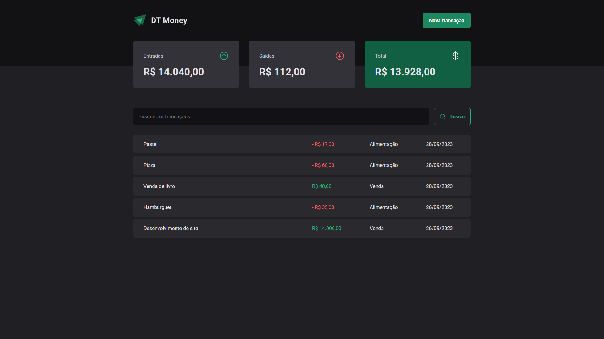
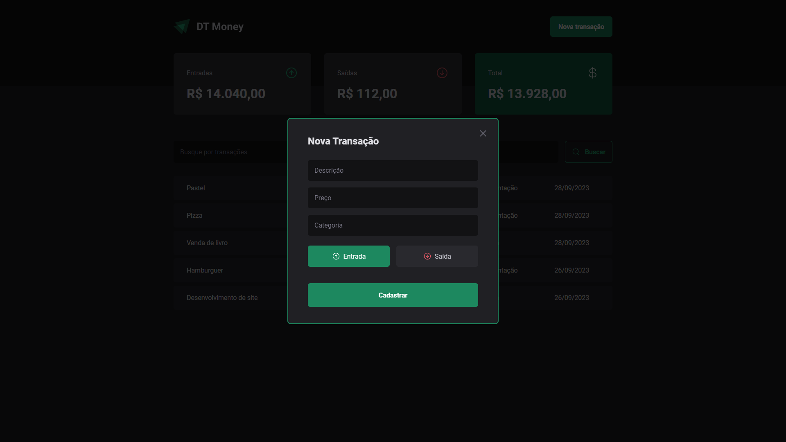

<div align="center">
  

  <h3 align="center">DT Money</h3>

  <p align="center">
      Expense tracking web project with API consuming
  </p>
  <p align="center">
    ENG •
    <!-- <a href="./README.ptbr.md">
      PT-BR
    </a> -->
  </p>
</div>

## About the Project
DT Money is a expense tracking project for managing your finances with API consuming, forms, measuring performance and taking care with the accessibility using React.js.

## Technologies
* styled-components;
* radix-ui;
* React Hook Form;
* JSON Server (only used on development, but it setup a future API connection);
* Axios;
* Hooks;
* Controlled Components;
* Context Selectors;
* ESLint;

## Knowledges
* Components;
* useCallback;
* Performance concepts: memo, useMemo, Context Selectors;
* Accessibility with radix-ui
  * Creation of a modal that will be read by the screen reader;
* Adding ESLint on the already started project;
* HTTP Requisition

## Screenshots



## Prerequisites
* npm
```
npm install npm@latest -g
```
## Installation
1. Clone the repo
```
git clone https://github.com/gabrielturri/dt-money.git
```
2. Install NPM packages
```
npm install
```
3. Run and open on your browser
```
npm run dev
```
4. Run the JSON server
```
npm run dev:server
```